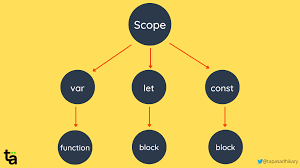

# Lecture 2
# About Scope and Hoisting!

# Waht is scope in Js?
## Scope in oblast vidimost ast, mintaqai muaian ,ki mo metavonem kodhoiamonro dar onjo navisem. The scope is the current context of execution in which values and expressionsare "visible" or can be referenced. If a variable or expression is not in the currentscope, it will not be available for use. Scopes can also be layered in a hierarchy,so that child scopes have access to parent scopes, but not vice versa.

# Scope chand khel meshavad?
.jpg)

## Scope 4 -khel meshavad:
- Global Scope : dar injo variabli a global scope ast dar hama jo kor mecunad
```
let a=5 ---> this is global scope
Console.log(a)
output
   5
```

- function scope : function scope az daruni  in scophoi funksia ba berun rafta nametavonad hamchunin agardar darun console .log() , kunem berunro khonda metavonad
```
function get(){
    let a=5;
    console.loh(a) --->output:5
}
console.log(a) --->output : a is not defind
------------------------------------------
function get(){
    ver a=5;
    console.loh(a) --->output:5
}
console.log(a) --->output : a is not defind
```
.jpg)
- block scope : in scope hoi if va for(loop) ast. darin scopeho ham variable az scope ho nametavonad ba berun ravad ammo variable var metavonad baroiad.
```
if(2===2){
    let a=5;
    console.loh(a) --->output : 5
}
console.log(a) --->output : a is not defind
------------------------------------------
if(2==2){
    ver a=5;
}
console.log(a) --->output : 5
```
.jpg)
- Modul scope in baroi dar iakchand file dar iak html kushodan ast. ki mo metavonem onhoro type : module dar atribut bidihem
.jpg)
# What is Hoisting in Js?
.png)
## Hoisting in boloravi ast ba anglisi hoisting nom dorad dar kadom holat ba amal meoiad holate ki mo dar bolo fariod mekunem ammo darr poion menavisem
.png)
# Hoisting in variables
## 1.variable var and const
.jpg)

```
console.log(a) --> output : Cannot access 'a' before initialization

let a=5
console.log(b) --- > output : Cannot access 'a' before initialization

const b=10
```
## 2.Hoisting in avariable var
.png)

```
console.log(a) --- > otput : underfind!
durust nishon meta ammo underfind in khatogi nest
to pesha meravad ammo javobsha namebinad misli empty value;

var a=3
```
# Hoisting in function?
.png)
## Hoisting in function decloration :
```
get() -->output : 5
function get(){
    let a=5
    log.(a)
}
```
## Hoistingin function expresion:
```
res() ---> output :  Cannot access 'res' before initialization


let res = () => {
    let a=6
    console.log(a);
}
```
# 

# What is Temporal Dead Zone in JS: in TDZ ast  in mintaqai murada menomand
.jpg)
## Temporal Dead Zode(TDZ) in let and const variable:
```
console.log.(a)
let a=5
console.log(b)
const b=4
```
## TDZ in function Expression
```
res()
let res = () => {
    let a=5
    console,log(a)
}
```